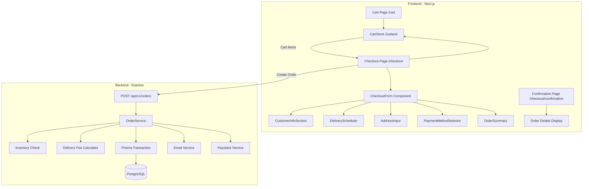

# Design Document: Checkout Flow

## Overview

This design document outlines the technical architecture for implementing a complete checkout flow for the BOMA 2025 streetwear e-commerce platform. The implementation extends the existing cart functionality (Zustand store) and backend order service to support delivery scheduling, guest checkout, and multiple payment methods. The design prioritizes backward compatibility with existing features while adding new capabilities.

## Architecture



### File Structure

```
my-streetwear-brand/
├── app/
│   ├── cart/
│   │   └── page.tsx                    # Cart page
│   ├── checkout/
│   │   ├── page.tsx                    # Checkout page
│   │   └── confirmation/
│   │       └── page.tsx                # Order confirmation page
├── src/
│   ├── components/
│   │   ├── checkout/
│   │   │   ├── CheckoutForm.tsx        # Main checkout form container
│   │   │   ├── CustomerInfoSection.tsx # Name, phone, email fields
│   │   │   ├── DeliveryScheduler.tsx   # Date picker + time window
│   │   │   ├── AddressInput.tsx        # Address fields + geolocation
│   │   │   ├── PaymentMethodSelector.tsx # COD vs Paystack
│   │   │   ├── OrderSummary.tsx        # Cart summary + totals
│   │   │   └── CheckoutSkeleton.tsx    # Loading state
│   │   └── cart/
│   │       └── CartPage.tsx            # Full cart page component
│   ├── hooks/
│   │   └── useCheckout.ts              # Checkout form state & submission
│   ├── lib/
│   │   ├── delivery-fees.ts            # Region-based fee calculation
│   │   ├── date-utils.ts               # Date validation & blackout logic
│   │   └── validation.ts               # Form validation schemas
│   └── types/
│       └── checkout.ts                 # Checkout-specific types

Backend (root /src):
├── services/
│   └── order.service.ts                # Extended with delivery scheduling
├── controllers/
│   └── order.controller.ts             # Extended for guest checkout
├── routes/
│   └── order.routes.ts                 # New guest order endpoint
└── utils/
    └── delivery-calculator.ts          # Delivery fee logic
```

## Components and Interfaces

### 1. Checkout Types

```typescript
// src/types/checkout.ts
export interface CheckoutFormData {
  customerName: string;
  phone: string;
  email?: string;
  deliveryDate: string;           // ISO date string
  timeWindow: TimeWindow;
  address: DeliveryAddress;
  paymentMethod: PaymentMethod;
}

export type TimeWindow = 'morning' | 'afternoon' | 'evening' | 'any';

export type PaymentMethod = 'cod' | 'paystack';

export interface DeliveryAddress {
  street: string;
  city: string;
  region: GhanaRegion;
  directions?: string;
  coordinates?: {
    lat: number;
    lng: number;
  };
}

export type GhanaRegion = 
  | 'greater-accra'
  | 'ashanti'
  | 'western'
  | 'eastern'
  | 'central'
  | 'volta'
  | 'northern'
  | 'upper-east'
  | 'upper-west'
  | 'bono'
  | 'bono-east'
  | 'ahafo'
  | 'savannah'
  | 'north-east'
  | 'oti'
  | 'western-north';

export interface CheckoutTotals {
  subtotal: number;
  deliveryFee: number;
  total: number;
}

export interface OrderConfirmation {
  orderId: string;
  scheduledDate: string;
  timeWindow: TimeWindow;
  address: DeliveryAddress;
  items: CartItem[];
  totals: CheckoutTotals;
  paymentMethod: PaymentMethod;
  paymentUrl?: string;  // For Paystack redirect
}
```

### 2. CheckoutForm Component

```typescript
// src/components/checkout/CheckoutForm.tsx
interface CheckoutFormProps {
  onSuccess: (confirmation: OrderConfirmation) => void;
}

// State Management:
// - Uses react-hook-form for form state
// - Zod schema for validation
// - useCheckout hook for submission logic

// Sections rendered:
// 1. CustomerInfoSection
// 2. DeliveryScheduler
// 3. AddressInput
// 4. PaymentMethodSelector
// 5. OrderSummary (sidebar on desktop, collapsible on mobile)
```

### 3. DeliveryScheduler Component

```typescript
// src/components/checkout/DeliveryScheduler.tsx
interface DeliverySchedulerProps {
  value: { date: string; timeWindow: TimeWindow };
  onChange: (value: { date: string; timeWindow: TimeWindow }) => void;
  error?: string;
}

// Date Logic:
// - minDate: tomorrow (or day after if past 6PM)
// - maxDate: 14 days from today
// - disabledDates: Sundays, public holidays (from date-utils.ts)

// Time Windows:
// - Morning: 9AM - 12PM
// - Afternoon: 12PM - 4PM
// - Evening: 4PM - 7PM
// - Any time (default)
```

### 4. AddressInput Component

```typescript
// src/components/checkout/AddressInput.tsx
interface AddressInputProps {
  value: DeliveryAddress;
  onChange: (address: DeliveryAddress) => void;
  errors?: Partial<Record<keyof DeliveryAddress, string>>;
}

// Geolocation Flow:
// 1. User clicks "Use My Location"
// 2. Request navigator.geolocation.getCurrentPosition()
// 3. On success: reverse geocode via Nominatim API (free)
// 4. Pre-fill street, city from response
// 5. Store coordinates for delivery optimization
// 6. On error: show message, allow manual entry
```

### 5. useCheckout Hook

```typescript
// src/hooks/useCheckout.ts
interface UseCheckoutReturn {
  submitOrder: (data: CheckoutFormData) => Promise<OrderConfirmation>;
  isSubmitting: boolean;
  error: string | null;
  inventoryErrors: InventoryError[] | null;
}

interface InventoryError {
  productId: string;
  variantId: string;
  title: string;
  requested: number;
  available: number;
}

// Submission Flow:
// 1. Validate form data
// 2. Call POST /api/v1/orders with cart items + checkout data
// 3. Handle inventory errors (show which items need adjustment)
// 4. On success: clear cart, return confirmation
// 5. If Paystack: redirect to payment URL
```

### 6. Delivery Fee Calculator

```typescript
// src/lib/delivery-fees.ts
export const DELIVERY_FEES: Record<GhanaRegion, number> = {
  'greater-accra': 20,
  'ashanti': 35,
  'western': 45,
  'eastern': 30,
  'central': 35,
  'volta': 40,
  'northern': 60,
  'upper-east': 70,
  'upper-west': 70,
  'bono': 50,
  'bono-east': 55,
  'ahafo': 50,
  'savannah': 65,
  'north-east': 65,
  'oti': 45,
  'western-north': 50,
};

export function calculateDeliveryFee(region: GhanaRegion): number {
  return DELIVERY_FEES[region] ?? 50; // Default fee
}
```

## Data Models

### Extended Order Schema (Prisma)

```prisma
model Order {
  id              String      @id @default(cuid())
  userId          String?     @map("user_id")  // Nullable for guest orders
  status          OrderStatus @default(PENDING)
  totalAmount     Decimal     @map("total_amount") @db.Decimal(10, 2)
  deliveryFee     Decimal     @default(0) @map("delivery_fee") @db.Decimal(10, 2)
  paymentRef      String?     @unique @map("payment_ref")
  paymentMethod   String      @default("cod") @map("payment_method")
  shippingAddress Json        @map("shipping_address")
  scheduledDate   DateTime?   @map("scheduled_date")
  timeWindow      String?     @map("time_window")
  customerName    String?     @map("customer_name")
  customerPhone   String?     @map("customer_phone")
  customerEmail   String?     @map("customer_email")
  createdAt       DateTime    @default(now()) @map("created_at")
  updatedAt       DateTime    @updatedAt @map("updated_at")
  user            User?       @relation(fields: [userId], references: [id])
  items           OrderItem[]

  @@map("orders")
}
```

### API Request/Response

```typescript
// Create Order Request
interface CreateOrderRequest {
  items: Array<{
    variantId: string;
    quantity: number;
  }>;
  customerName: string;
  customerPhone: string;
  customerEmail?: string;
  deliveryDate: string;
  timeWindow: TimeWindow;
  shippingAddress: DeliveryAddress;
  paymentMethod: PaymentMethod;
}

// Create Order Response
interface CreateOrderResponse {
  success: boolean;
  data: {
    orderId: string;
    status: OrderStatus;
    scheduledDate: string;
    timeWindow: string;
    totalAmount: number;
    deliveryFee: number;
    paymentMethod: string;
    paymentUrl?: string;  // Only for Paystack
  };
}

// Inventory Error Response
interface InventoryErrorResponse {
  success: false;
  error: 'INVENTORY_ERROR';
  message: string;
  items: Array<{
    variantId: string;
    productTitle: string;
    size: string;
    color: string;
    requested: number;
    available: number;
  }>;
}
```

## Error Handling

### Form Validation Errors
- Display inline below each field
- Scroll to first error on submit
- Use Zod schema for consistent validation

### Inventory Errors
- Return structured error with affected items
- Display modal/alert with options to adjust or remove
- Allow user to fix and retry

### Network Errors
- Show toast notification for transient errors
- Provide retry button
- Don't clear form data on error

### Geolocation Errors
- Handle permission denied gracefully
- Show fallback message
- Allow manual address entry

## Testing Strategy

### Unit Testing
- Form validation logic (Zod schemas)
- Delivery fee calculation
- Date utility functions (blackout dates, min/max dates)
- Phone number validation

### Property-Based Testing
- Delivery fee calculation consistency
- Date validation rules
- Form data round-trip (serialize/deserialize)

### Integration Testing
- Checkout form submission flow
- Inventory validation
- Guest vs authenticated checkout

### E2E Testing
- Full checkout happy path
- Inventory error handling
- Payment method switching


## Correctness Properties

*A property is a characteristic or behavior that should hold true across all valid executions of a system-essentially, a formal statement about what the system should do. Properties serve as the bridge between human-readable specifications and machine-verifiable correctness guarantees.*

Based on the acceptance criteria analysis, the following properties have been identified for property-based testing:

### Property 1: Cart Total Calculation Consistency
*For any* cart state with items, the displayed total SHALL equal the sum of (price × quantity) for all items.
**Validates: Requirements 1.4, 5.2**

### Property 2: Quantity Minimum Bound
*For any* cart item, regardless of how many decrement operations are applied, the quantity SHALL never be less than 1.
**Validates: Requirements 1.2**

### Property 3: Customer Name Validation
*For any* string with length less than 2 characters, the name validation SHALL fail. *For any* string with length >= 2 characters, the name validation SHALL pass.
**Validates: Requirements 2.4**

### Property 4: Ghana Phone Number Validation
*For any* string matching the pattern `^(\+233|0)[0-9]{9}$`, the phone validation SHALL pass. *For any* string not matching this pattern, the phone validation SHALL fail.
**Validates: Requirements 2.5**

### Property 5: Email Validation (Optional Field)
*For any* empty string or undefined value, the email validation SHALL pass. *For any* non-empty string matching valid email format, the validation SHALL pass. *For any* non-empty string not matching email format, the validation SHALL fail.
**Validates: Requirements 2.3, 2.6**

### Property 6: Delivery Date - Past Date Rejection
*For any* date before today, the date validation SHALL reject it as invalid.
**Validates: Requirements 3.2**

### Property 7: Delivery Date - Future Limit
*For any* date more than 14 days from today, the date validation SHALL reject it as invalid.
**Validates: Requirements 3.3**

### Property 8: Delivery Date - Blackout Days
*For any* date that falls on a Sunday, the date validation SHALL reject it as invalid.
**Validates: Requirements 3.4**

### Property 9: Minimum Lead Time Calculation
*For any* current time before 6PM, the minimum delivery date SHALL be tomorrow. *For any* current time at or after 6PM, the minimum delivery date SHALL be the day after tomorrow.
**Validates: Requirements 3.7**

### Property 10: Delivery Fee by Region
*For any* valid Ghana region, the calculated delivery fee SHALL match the predefined fee for that region.
**Validates: Requirements 5.3**

### Property 11: Total Calculation
*For any* checkout state with subtotal and delivery fee, the total SHALL equal subtotal + delivery fee.
**Validates: Requirements 5.4**

### Property 12: Required Field Validation
*For any* checkout form submission with any required field (name, phone, street, city, region, deliveryDate) empty, the form validation SHALL fail and prevent submission.
**Validates: Requirements 10.1**

### Property 13: Inventory Validation Response
*For any* order request where requested quantity exceeds available stock for any item, the system SHALL return an inventory error response identifying all affected items with their available quantities.
**Validates: Requirements 6.2, 6.3, 6.5**

### Property 14: Guest Order Creation
*For any* valid order request without userId, the system SHALL create an order record with the provided customer contact information (name, phone, email).
**Validates: Requirements 8.2**

### Property 15: Authenticated Order Association
*For any* valid order request with authenticated user, the created order SHALL have userId set to the authenticated user's ID.
**Validates: Requirements 8.5**

### Property 16: COD Payment Method Behavior
*For any* order created with paymentMethod='cod', the order status SHALL be PENDING and no payment redirect URL SHALL be returned.
**Validates: Requirements 9.2**

### Property 17: Cart Clear on Confirmation
*For any* successful order creation, after displaying the confirmation page, the cart state SHALL be empty (0 items).
**Validates: Requirements 7.8**

### Property 18: Order Confirmation Data Completeness
*For any* successful order, the confirmation response SHALL include orderId, scheduledDate, timeWindow, and all address fields.
**Validates: Requirements 7.3, 7.4, 7.5**

