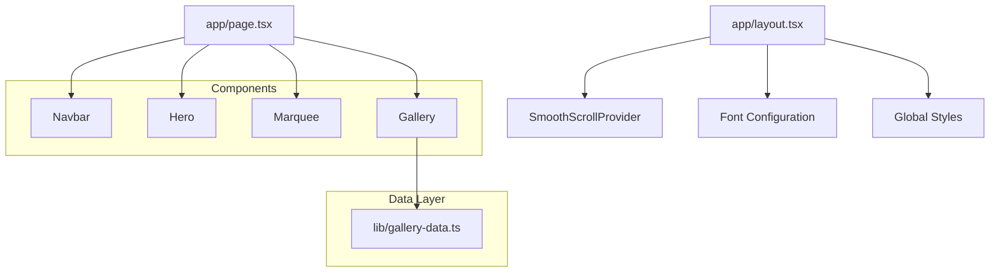

# Design Document: Streetwear Landing Page

## Overview

This design document outlines the technical architecture for a high-end streetwear brand landing page. The implementation leverages Next.js 14 App Router with TypeScript, Tailwind CSS for styling, and Framer Motion for animations. The design follows brutalist/minimalist principles with emphasis on bold typography, high contrast, and smooth interactions.

## Architecture



### File Structure

```
my-streetwear-brand/
├── src/
│   ├── app/
│   │   ├── layout.tsx          # Root layout with fonts & smooth scroll
│   │   ├── page.tsx            # Main landing page assembly
│   │   └── globals.css         # Global styles
│   ├── components/
│   │   ├── Navbar.tsx          # Fixed navigation with scroll detection
│   │   ├── Hero.tsx            # Full-screen hero section
│   │   ├── Marquee.tsx         # Infinite scrolling text banner
│   │   ├── Gallery.tsx         # Bento grid image gallery
│   │   └── SmoothScroll.tsx    # Lenis smooth scroll wrapper
│   └── lib/
│       ├── gallery-data.ts     # Gallery image data
│       └── utils.ts            # Utility functions (cn helper)
```

## Components and Interfaces

### 1. Gallery Data Interface

```typescript
// src/lib/gallery-data.ts
export interface GalleryItem {
  id: string;
  src: string;        // Path starting with /lookbook/
  alt: string;
  title: string;
  span: string;       // Tailwind grid span classes
}

export const galleryData: GalleryItem[];
```

### 2. Navbar Component

```typescript
// src/components/Navbar.tsx
interface NavbarProps {}

// State Management:
// - scrolled: boolean - tracks if user has scrolled past 0
// - Uses useEffect with scroll event listener
// - Cleanup on unmount

// Styling Logic:
// - Default: bg-transparent
// - Scrolled: bg-black/90 backdrop-blur-md
// - Transition: transition-all duration-300
```

### 3. Hero Component

```typescript
// src/components/Hero.tsx
interface HeroProps {}

// Animation Configuration:
// - Container: staggerChildren: 0.2
// - Headline: fadeInUp with delay
// - CTA Button: fadeInUp with longer delay

// Framer Motion Variants:
const containerVariants = {
  hidden: { opacity: 0 },
  visible: {
    opacity: 1,
    transition: { staggerChildren: 0.2 }
  }
};

const itemVariants = {
  hidden: { opacity: 0, y: 50 },
  visible: { opacity: 1, y: 0 }
};
```

### 4. Marquee Component

```typescript
// src/components/Marquee.tsx
interface MarqueeProps {}

// Animation: Infinite horizontal scroll
// - Uses Framer Motion animate prop
// - x: ["0%", "-50%"] for seamless loop
// - Duration: 20s linear infinite
// - Content duplicated for seamless loop
```

### 5. Gallery Component

```typescript
// src/components/Gallery.tsx
interface GalleryProps {}

// Grid Configuration:
// - CSS Grid with auto-fill columns
// - Variable spans via data properties
// - Gap: 4 (1rem)

// Animation:
// - whileInView trigger
// - Initial: opacity: 0, y: 50, scale: 0.95
// - Animate: opacity: 1, y: 0, scale: 1
// - Viewport: once: true, amount: 0.3

// Hover Effects:
// - Image: scale(1.05) on hover
// - Overlay: opacity 0 → 1 with title text
```

### 6. SmoothScroll Provider

```typescript
// src/components/SmoothScroll.tsx
"use client";

// Wraps children with Lenis smooth scroll
// - Initializes Lenis instance
// - RAF loop for smooth updates
// - Cleanup on unmount
```

## Data Models

### Gallery Item Schema

| Property | Type   | Description                          | Example                    |
|----------|--------|--------------------------------------|----------------------------|
| id       | string | Unique identifier                    | "1"                        |
| src      | string | Image path from public folder        | "/lookbook/image1.jpg"     |
| alt      | string | Accessible image description         | "Model in black hoodie"    |
| title    | string | Display title for overlay            | "BOMA COLLECTION"          |
| span     | string | Tailwind grid span classes           | "col-span-2 row-span-2"    |

### Span Options

- `""` - Default 1x1 cell
- `"col-span-2"` - Wide cell (2 columns)
- `"row-span-2"` - Tall cell (2 rows)
- `"col-span-2 row-span-2"` - Large featured cell

## Error Handling

### Image Loading
- Use Next.js Image component with placeholder="blur" where possible
- Fallback to standard img with loading="lazy" for dynamic sources
- Handle missing images gracefully with CSS background fallback

### Scroll Events
- Debounce scroll listener to prevent performance issues
- Use passive event listeners for better scroll performance
- Cleanup event listeners on component unmount

### Animation Performance
- Use `will-change` CSS property sparingly
- Leverage GPU acceleration via transform properties
- Use `whileInView` with `once: true` to prevent re-triggering

## Testing Strategy

### Visual Testing
- Verify navbar transparency at scroll position 0
- Verify navbar solid background when scrolled
- Confirm hero animations trigger on page load
- Validate marquee continuous loop without gaps
- Test gallery viewport animations on scroll
- Verify hover effects on gallery items

### Responsive Testing
- Test on mobile (375px), tablet (768px), desktop (1440px)
- Verify grid layout adapts appropriately
- Confirm touch interactions work on mobile

### Performance Testing
- Lighthouse score targets: Performance > 90
- First Contentful Paint < 1.5s
- Largest Contentful Paint < 2.5s
- Cumulative Layout Shift < 0.1

## Design Tokens

### Colors
```css
--color-background: #000000;
--color-foreground: #ffffff;
--color-accent: #ffffff;
--color-overlay: rgba(0, 0, 0, 0.7);
```

### Typography
```css
--font-heading: 'Oswald', sans-serif;
--font-body: 'Inter', sans-serif;
--font-size-hero: clamp(3rem, 10vw, 8rem);
--font-size-nav: 0.875rem;
--font-size-marquee: 1.5rem;
```

### Spacing
```css
--spacing-section: 6rem;
--spacing-container: clamp(1rem, 5vw, 4rem);
--grid-gap: 1rem;
```

### Transitions
```css
--transition-fast: 150ms ease;
--transition-medium: 300ms ease;
--transition-slow: 500ms ease;
```

## Dependencies

### Required (Already Installed)
- `next`: 16.0.7
- `react`: 19.2.0
- `framer-motion`: ^12.23.25
- `clsx`: ^2.1.1
- `tailwind-merge`: ^3.4.0
- `tailwindcss`: ^4

### To Install
- `@studio-freight/lenis`: ^1.0.42 - Smooth scroll library

## Implementation Notes

### Tailwind CSS v4 Considerations
- Uses new CSS-first configuration approach
- Custom properties defined in globals.css
- No tailwind.config.js needed for basic setup

### Next.js 14+ App Router
- All interactive components must be marked with "use client"
- Layout.tsx handles font loading and global providers
- Page.tsx assembles server and client components

### Image Optimization
- Use actual BOMA 2025 image filenames from public/lookbook
- URL encode special characters in filenames
- Consider creating simplified aliases for cleaner code
